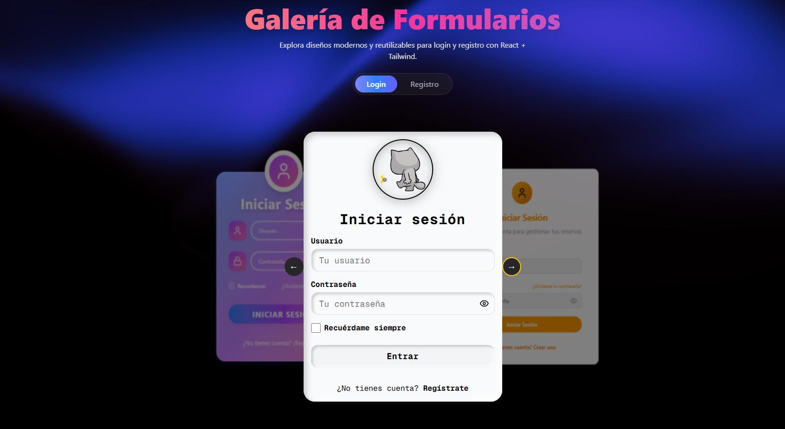

# 📸 FormGallery

Una galería interactiva de formularios de **Login** y **Registro**, desarrollada con **React**, **TypeScript** y **TailwindCSS**. Ideal para inspiración visual, pruebas de estilos y selección rápida de componentes reutilizables.




---

## 🚀 Características

- 💡 Alternancia instantánea entre formularios de **Login** y **Registro**
- 🎨 12 estilos únicos para cada tipo de formulario
- ⚡ Animaciones fluidas con `framer-motion`
- 📱 Diseño completamente responsive
- 🧩 Componentes desacoplados y reutilizables
- 🖱️ Interacción tipo polaroid `draggable` (inspirado en Aceternity UI)
- 🛠️ Fácil integración de nuevos estilos o componentes

---

## 🛠️ Tecnologías utilizadas

- [Next.js](https://nextjs.org/) — Framework React para aplicaciones web modernas
- [TypeScript](https://www.typescriptlang.org/) — Tipado estático para JavaScript
- [Tailwind CSS](https://tailwindcss.com/) — Utilidades CSS para un diseño rápido y personalizable
- [Framer Motion](https://www.framer.com/motion/) — Animaciones declarativas para React
- [shadcn/ui](https://ui.shadcn.dev/) — Componentes UI accesibles y personalizables

---

## ✨ Demo

¿Quieres ver la galería en acción? [¡Haz clic aquí para ver la demo!](https://formgallery.vercel.app/)

---

## 📦 Instalación local

1. Clona el repositorio:
   ```bash
   git clone https://github.com/ABengelsdorff/formgallery.git
   cd formgallery
   ```
2. Instala las dependencias:
   ```bash
   npm install
   ```
3. Inicia el servidor de desarrollo:
   ```bash
   npm run dev
   ```
4. Abre [http://localhost:3000](http://localhost:3000) en tu navegador.

---

## 📁 Estructura del proyecto

```
front/
  ├── src/
  │   ├── app/                # Páginas principales y layout global
  │   ├── components/         # Componentes reutilizables
  │   │   ├── login/          # Formularios de Login (12 estilos)
  │   │   ├── register/       # Formularios de Registro (12 estilos)
  │   │   └── ui/             # Componentes UI (botón, input, etc.)
  │   └── hooks/              # Custom hooks
  └── public/                 # Recursos estáticos (imágenes, SVGs)
```

---

## 🤝 Contribuciones

¡Las contribuciones son bienvenidas! Si tienes ideas para nuevos estilos de formularios, mejoras o encuentras algún bug, no dudes en abrir un issue o un pull request.

---

## 📄 Licencia

Este proyecto está bajo la licencia MIT.

---

## ✨ Créditos

Hecho con ❤️ por Angélica Bengelsdorff
